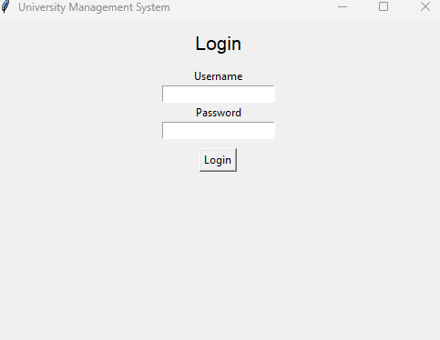

# 🎓 University Management System (Tkinter GUI)

This is a Python-based University Management System built using **Tkinter GUI** and **OOP concepts**. It includes an interactive interface for managing students, faculty, and courses — with login authentication and role-based dashboards.

> **Built by:** Prachi Singh  
> **Repository:** https://github.com/prachids-356/university-management-system

---

## ✨ Features

- 🔐 **Login system** for Admin, Faculty, and Students
- 👤 Add **Students**, **Faculty**, and **Courses**
- 📚 Assign faculty to courses and enroll students with **prerequisite check**
- 🧾 View structured data (course roster, enrolled students, assigned faculty)
- 🖥️ Interactive and clean **Tkinter-based GUI**

---

## 🖼️ Screenshots

### 🔐 Login Screen


### 🧭 Admin Dashboard


---

## 🚀 How to Run

### ✅ Prerequisites
- Python 3.x installed
- Tkinter module (usually included with Python)

### ▶️ Run the Project

```bash
python university_gui.py
