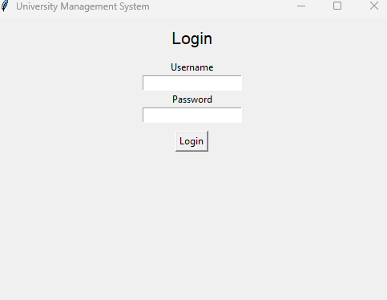
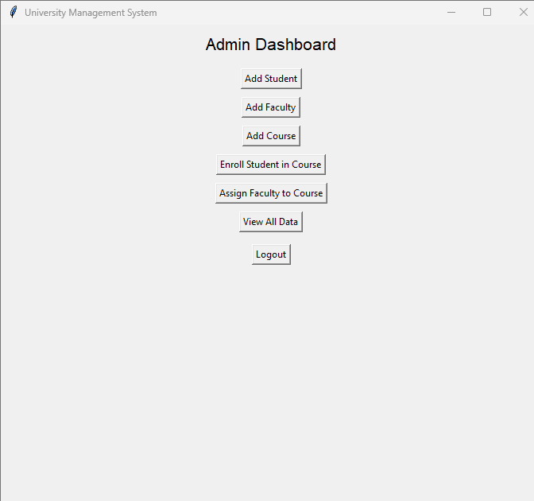

# 🎓 University Management System (Tkinter GUI)

A Python University Management System built with **Tkinter** and OOP: role-based login,
students / faculty / courses, prerequisite-checked enrollment, and JSON persistence.

> **Built by:** Prachi Singh
> **Repository:** https://github.com/prachids-356/university-management-system

---

## ✨ Features

- 🔐 **Role-based login** — Admin, Faculty and Student each get their own dashboard and permissions
- 👤 Add **Students**, **Faculty** and **Courses**, with validation on every field
- 📚 Assign faculty to courses and enroll students with a **prerequisite check** based on *completed* courses
- 💾 **Data persists** between runs in `data.json`
- 🧾 Browse all records in a sortable tree view
- ✅ Unit tests and CI

---

## 🗂️ Project layout

```
university/          shared domain package (imported by both entry points)
  models.py          Person, Student, Faculty, Course, Enrollment, University
  auth.py            password hashing, roles, permissions
  storage.py         JSON load/save
gui.py               Tkinter application
cli.py               console demo
tests/               pytest suite
ARCHITECTURE.md      roadmap for growing this into a web service
```

---

## 🖼️ Screenshots

### 🔐 Login Screen


### 🧭 Admin Dashboard


---

## 🚀 How to Run

**Prerequisites:** Python 3.10+ and Tkinter
(`sudo apt install python3-tk` on Debian/Ubuntu; bundled with Python on Windows and macOS).

```bash
python gui.py    # Tkinter application
python cli.py    # console demo of the same domain model
```

### 🔑 Default accounts

If no `users.json` is present, three demo accounts are created at startup:

| Username | Password       | Can do                     |
|----------|----------------|----------------------------|
| admin    | `admin123`     | everything                 |
| faculty  | `faculty123`   | enroll students, view data |
| student  | `student123`   | view data                  |

These are development credentials only, hashed in memory at startup and never written to disk. To set real ones, generate a `users.json`:

```python
from university.auth import Role, User, hash_password, save_users

salt, digest = hash_password("your-password")
save_users({"admin": User("admin", Role.ADMIN, salt, digest)})
```

`users.json` and `data.json` are git-ignored.

---

## 🧪 Tests & linting

```bash
pip install -r requirements-dev.txt
pytest -q
ruff check .
```

---

## 🐳 Docker

```bash
docker build -t ums .
docker run --rm -v "$PWD/data:/data" ums              # console demo
docker run --rm -e DISPLAY=$DISPLAY \
  -v /tmp/.X11-unix:/tmp/.X11-unix ums python gui.py  # GUI, Linux host with X11
```
